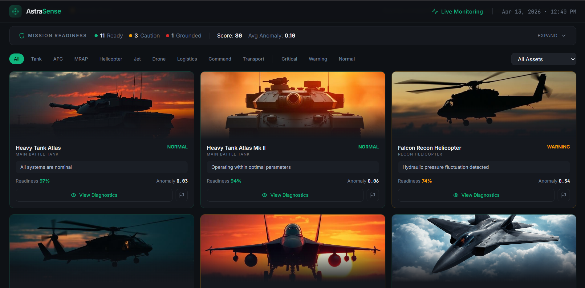
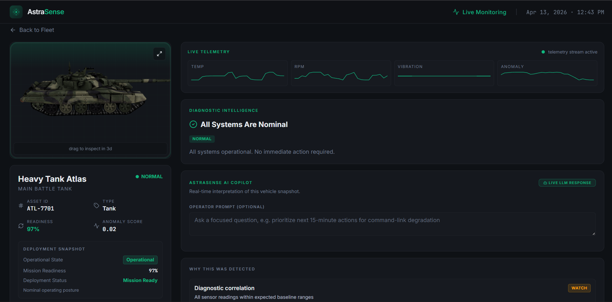

# AstraSense

AstraSense is a fleet intelligence and anomaly-monitoring prototype for defense-style vehicles, built to help operators detect abnormal telemetry, inspect asset health, and receive structured AI-assisted guidance.

## What This Project Does

- Shows fleet readiness and anomaly status in one place 📊
- Lets you open an asset and inspect telemetry details
- Converts telemetry snapshots into structured diagnostics with clear recommended actions
- Serves frontend + API from one service on Render

## What Makes It Different

- Focuses on telemetry-to-action interpretation, not just raw metric display
- Uses mission-readiness framing so anomalies are tied to operational impact
- Returns structured diagnostic reasoning instead of free-form chatbot output

## Visual Walkthrough

### Fleet Overview

Top section with fleet graph and trend context:


Vehicles dashboard and mission readiness view:



### Asset Detail

Per-asset telemetry and health inspection view:



### AI Diagnostic Result

Structured AI analysis output with recommended action:


## API Contract (`POST /api/ai/diagnostics`)

The backend always returns JSON in this shape:

```json
{
  "summary": "string",
  "whyDetected": "string",
  "likelyCause": "string",
  "confidence": 78,
  "recommendedAction": "string"
}
```

API routes are always JSON-based and do not fall back to HTML responses.

## Tech Stack

- Node/Express serves both API and frontend
- React + TypeScript + Vite
- Tailwind + Radix UI
- React Three Fiber + Three.js
- Groq/xAI-compatible chat API integration
- Docker + Render

## Why It Exists

Most dashboards tell you something changed.
AstraSense tries to tell you what changed, why it matters, and what to do next. 🧠

## Local Development

### Prerequisites

- Node.js 18+
- npm

### Setup

```bash
git clone https://github.com/pratiksharan/AstraSense.git
cd AstraSense
npm install
```

### Run Frontend Only

```bash
npm run dev
```

### Run Frontend + API

```bash
npm run dev:full
```

### Run Production Mode Locally

```bash
npm run build
npm start
```

## Environment Variables (`.env`)

Use these values in Render or local development:

- `AI_PROVIDER=groq`
- `GROQ_API_KEY=your_api_key`
- `GROQ_MODEL=llama-3.1-8b-instant`
- `AI_MODEL=llama-3.1-8b-instant` (optional override)

## Deployment (Render)

AstraSense runs as one Dockerized web service:

- Build uses Vite
- Runtime uses the Express server
- Frontend and API share the same URL ✅

## Notes

Telemetry data in this prototype is synthetic, but constrained to realistic ranges and drift patterns.
The objective is to evaluate monitoring and response workflows under operational-style conditions.
