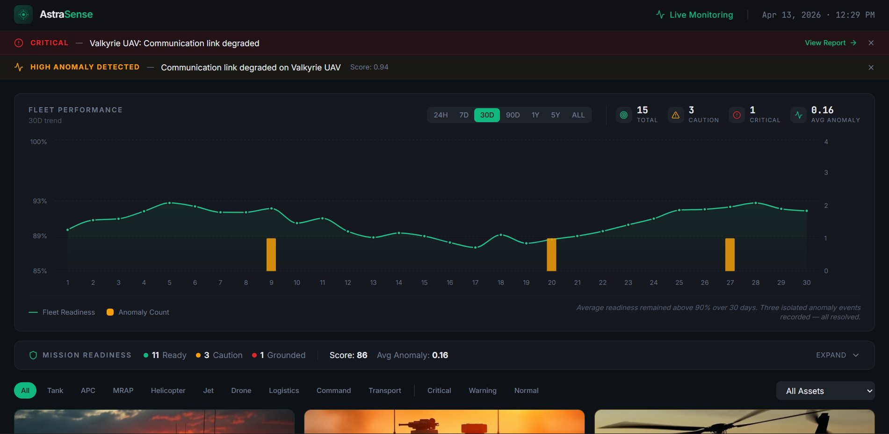
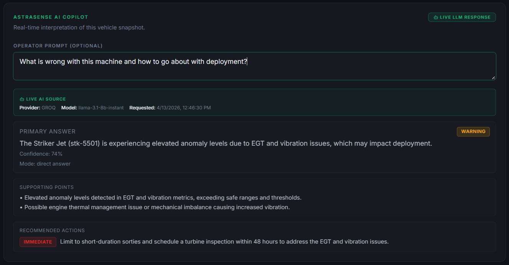

# AstraSense

AstraSense is a full-stack fleet intelligence prototype for defense-style assets.
It combines telemetry monitoring, anomaly interpretation, and AI-assisted decision support in a single operator workflow.

## Core Capabilities

- Fleet command view with readiness trends, anomaly counts, and critical alerts
- Asset investigation workspace with live telemetry drift analysis and incident timeline
- 3D asset inspection pipeline with model registry, fallback model handling, and image fallback
- AI diagnostics endpoint that returns structured operational guidance (not free-form chat output)
- Single-service runtime where one Express process serves both API and frontend

## Why This Is Different

- Telemetry-to-action framing: diagnostics are oriented around operational decisions
- Mission-readiness context: status is presented as deploy-ready, caution, or do-not-deploy
- Structured reasoning path: summary, why detected, likely cause, confidence, and recommended action
- Built-in resilience: API fallback responses preserve UI stability when upstream AI is unavailable

## Visual Walkthrough

### Fleet Overview




### Asset Detail


### AI Diagnostic Result



## Architecture

### Frontend

- React + TypeScript + Vite application
- Routes:
  - `/` for fleet overview
  - `/asset/:id` for per-asset diagnostics
- UI stack includes Tailwind, Radix components, Recharts, and React Three Fiber

### Backend

- Express server hosts API and static frontend from `dist`
- Health endpoint: `GET /api/health`
- Diagnostics endpoint: `POST /api/ai/diagnostics`
- API routes never fall through to HTML

### AI Integration

- Provider selection supports Groq/xAI-compatible APIs
- Prompt mode adapts to operator intent (snapshot/action/fix focus)
- Normalized response shape is enforced server-side
- Response metadata headers include provider, model, and request timestamp

### Telemetry and Analytics

- Synthetic fleet dataset with realistic bounded ranges across multiple asset classes
- Live metric drift simulation and sparkline trend updates on the asset page
- Severity grouping for telemetry rows: critical, monitored, stable
- Evidence blocks and timeline classification support fast operator triage

## API Contract

`POST /api/ai/diagnostics` returns:

```json
{
  "summary": "string",
  "whyDetected": "string",
  "likelyCause": "string",
  "confidence": 78,
  "recommendedAction": "string"
}
```

This contract is used by the frontend parser and remains JSON-only.

## Tech Stack

- React 18, TypeScript, Vite
- Node.js, Express
- Tailwind CSS, Radix UI
- React Three Fiber, Three.js
- Recharts
- Vitest
- Docker, Render

## Local Development

Requires Node.js 18+ and npm.

### Install

```bash
git clone https://github.com/pratiksharan/AstraSense.git
cd AstraSense
npm install
```

### Run Full Stack (Frontend + API)

```bash
npm run dev:full
```

### Run Production Mode Locally

```bash
npm run build
npm start
```

## Environment Variables

Use `.env` (or Render environment settings):

- `AI_PROVIDER` = `auto`, `groq`, `grok`, or `xai`
- `GROQ_API_KEY` or `GROK_API_KEY`
- `GROQ_MODEL` (provider-specific default)
- `AI_MODEL` (optional global override)
- `PORT` (local fallback; Render sets this automatically)

## Deployment

The app is configured for single-service Render deployment:

- Build command: `npm install; npm run build`
- Start command: `npm start`
- Health check: `/api/health`
- Docker runtime available via [Dockerfile](Dockerfile)

## Prototype Scope

Telemetry is synthetic but intentionally constrained to realistic ranges and drift patterns.
The prototype is designed to demonstrate monitoring workflow, anomaly reasoning, and action guidance under operational-style conditions.
